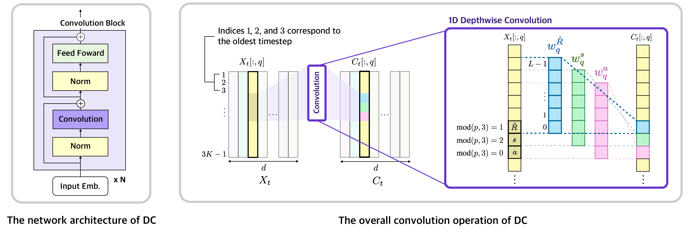

# Decision ConvFormer: Local Filtering in MetaFormer is Sufficient for Decision Making

## Overview

Decision ConvFormer Architecture:

## Acknowledgements
Our Decision ConvFormer code is based on [decision-transformer](https://github.com/kzl/decision-transformer).

## Instructions

We provide code in two sub-directories: `atari` containing code for Atari experiments and `gym` containing code for OpenAI Gym experiments.
See corresponding READMEs in each folder for instructions; scripts should be run from the respective directories.
It may be necessary to add the respective directories to your PYTHONPATH.